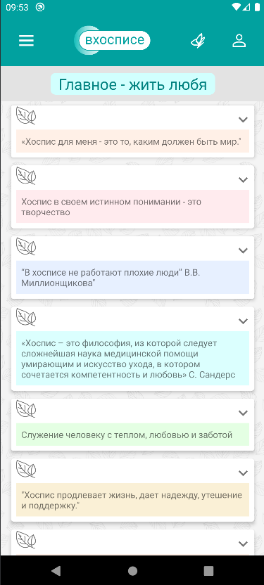
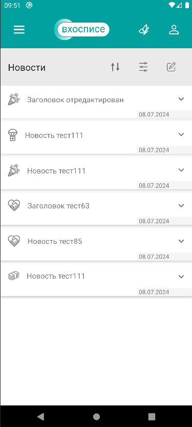
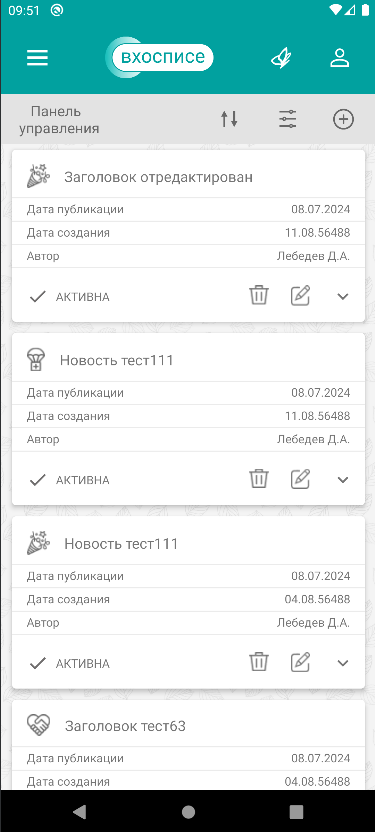
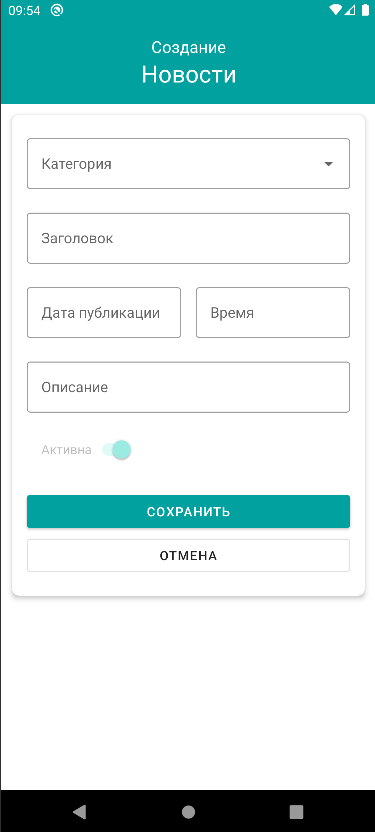
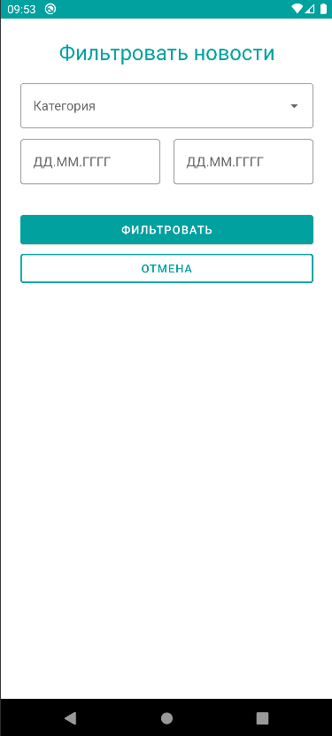
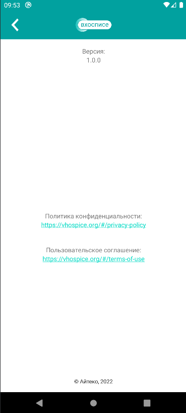

# План по проверке и автоматизации приложения

## **Содержание**

1. [Описание приложения](#1-описание-приложения)
2. [Описание блоков приложения](#2-описание-блоков-приложения)
3. [Тестовая документация](#3-тестовая-документация)
4. [Виды тестирования](#4-виды-тестирования)
5. [Устройства для тестирования(окружение)](#5-устройства-для-тестированияокружение)
6. [Инструменты для тестирования и автоматизации](#6-инструменты-для-тестирования-и-автоматизации)
7. [Перечень необходимых разрешений, данных и доступов](#7-перечень-необходимых-разрешений-данных-и-доступов)
8. [Перечень и описание возможных рисков при автоматизации](#8-перечень-и-описание-возможных-рисков-при-автоматизации)
9. [ Перечень необходимых специалистов для автоматизации](#9-перечень-необходимых-специалистов-для-автоматизации)
10. [ Интервальная оценка](#10-интервальная-оценка)
11. [Этапы проверки приложения](#11-этапы-проверки-приложения)
12. [Перечень автоматизируемых сценариев]()
13. [Перечень сценариев ручного тестирования]()

## 1. Описание приложения

Мобильное приложение "Мобильный хоспис" версия 1.0.0. Приложение предоставляет функционал для работы
с новостями хосписа,чтение теметических цитат и включает в себя:

- Информацию о новостях и функционал для работы с ними.
- Тематические цитаты.
- Информацию о приложении.

## 2. Описание блоков приложения

**Приложение состоит из следующих блоков (страниц):**

#### "Авторизация".

  

#### "Главная".

  

#### "Цитаты".

  

#### "Новости".

  

#### "Панель управления новостями".

  

#### "Создание новости".

  

#### "Фильтр новостей на панели управления новостями"

#### "Фильтр новостей на странице новости".

#### "О приложении".

## 3. Тестовая документация

    - План тестирования
    - Чек-лист
    - Тест-кейсы
    - Баг-репорты
    - Отчёт о тестировани

## 4. Виды тестирования

### 4.1 Функциональное тестирование

    -**Загрузка приложения**
    - **Авторизация**
    - **Главная страница**
      - Отображение новостей
    - **Цитаты**
      - Отображение цитат
    - **Меню**
      - Навигация
    - **Работа с Новостями**
      - Отображение новостей
      - Фильтрация новостей
      - Сортировка новостей
      - Навигация в разделу новости
    - **Панель Управления**
      - Создание новости
      - Фильтрация новостей
      - Сортировка новостей
      - Редактирование новостей
      - Удаление новостей
      - Отображение новостей
      - Изменение статуса (Актив / Не активна)
    - **О Приложении**

### 4.2 UI/UX тестирование

    - Соответствие макетам(отсутствуют)
    - Удобство использования

### 4.3 Тестирование локализации

    - Язык приложения должен соответствовать языку системы

### 4.4 Тестирование совместимости

    -  Работа приложения на различных версиях Android
    -  На устройствах с различными разрешениями экрана
    -  С разной скоростью интернет-соединения и типом соединения

### 4.5 Тестирование установки

    - Установка и удаление приложения

### 4.6 По степени автоматизации

    - Ручное
    - Автоматезированное

## 5. Устройства для тестирования(окружение)

### 5.1 Компьютер с операционной системой:

    Процессор:	AMD Ryzen 7 6800H with Radeon Graphics  3.20 GHz
    Оперативная память:	16,0 ГБ (доступно: 15,2 ГБ)
    Тип системы:	64-разрядная операционная система, процессор x64

### 5.2 Эмулятор Android

    Устройство Pixel 8 Pro API 29 (Android SDK built for x86)
    Версия Android: 10
    Версия ядра 4.14.112+
    Разрешение: 1344 x 2992 px
    Память: 16 GB
    RAM: 2 GB

## 6. Инструменты для тестирования и автоматизации

### 6.1 Перечень используемых инструментов с обоснованием выбора:

- **Android studio**- официальная среда разработки для Android, которая предоставляет широкий спектр инструментов для создания, тестирования и отладки приложений.
- **Эмулятор Android с версией API 29** - это позволит тестировать приложение без необходимости иметь физические устройства. Версия API 29 является достаточно новой и поддерживает большинство современных функций Android.
- **Espresso** -  framework для тестирования пользовательского интерфейса Android-приложений. Он позволяет создавать автоматические тесты, которые имитируют действия пользователя, такие как нажатия на кнопки, ввод текста и т.д. Espresso является достаточно популярным и простым в использовании инструментом.
- **Allure Framework** - инструмент для создания отчетов о тестировании. Он позволяет создавать подробные отчеты о прохождении тестов, включая скриншоты, логи и другие данные. Allure достаточно гибкий и настраиваемый, что делает его популярным выбором среди разработчиков и тестировщиков.
- **Git и Github** - система контроля версий и хостинг для кода.
- **JUnit** - мощный и гибкий обновленный фреймворк JUnit, которое предоставляет множество улучшений и новых функций для написания тестов.

## 7. Перечень необходимых разрешений, данных и доступов

### 7.1 Данные:

    - Логин и пароль - для доступа к аккаунту

### 7.2 Доступы:

    - Доступ к эмулятору или физическому устройству - для запуска приложения и тестирования его функций
    - Доступ к системным настройкам - для изменения настроек системы и тестирования функций, связанных с ними
    - Доступ к API - для тестирования функций, связанных с API
    - Доступ к базе данных - для тестирования функций, связанных с базой данных
    - Доступ к исходному коду, для написания автотестов

### 7.3 Разрешения

    - Разрешение на тестирование и автоматизацию тестирования
    - Разрешение на использование SQL и XSS инъекций
    - Разрешение на использование инструментов для тестирования производительности (например, Apache JMeter и т.д.)

## 8. Перечень и описание возможных рисков при автоматизации

### 8.1 Риски:

    - Нестабильность тестовой среды - проблемы с эмуляторами или физическими устройствами могут привести к нестабильности тестовой среды.
    - Проблемы с совместимостью - приложение может не работать корректно на разных устройствах, платформах или версиях операционной системы.
    - Проблемы с поддержкой автоматизации - автоматизация может требовать дополнительных ресурсов и поддержки, что может быть затратно.
    - Задержки в разработке тестов - разработка автоматизированных тестов может занять больше времени, чем ожидается

## 9. Перечень необходимых специалистов для автоматизации

- Тестировщик-автоматизатор с опытом работы в Android Studio, Espresso, Allure Framework, Git, Github и JUnit - 1 единица

## 10. Интервальная оценка

### 10.1 Интервальная оценка с учётом рисков в часах:

- **Создание документации**

  - Определение границ приложения и возможных функций - 4 часа
  - Создание плана тестирования - 12 часов
  - Создание чек-листа - 4 часа
  - Создание тест-кейсов - 16 часов
- **Подготовка к тестированию**

  - Настройка тестовой среды (Android Studio, Эмулятор Android, Espresso, Allure Framework, Git, Github, JUnit) - 8 часов
- **Разработка тестов**

  - Разработка автоматизированных тестов - 96 часов
- **Анализ результатов и создание тестовых отчётов**

  - Анализ результатов тестирования - 8 часов
  - Создание баг-репортов - 16 часов
  - Создание отчета о тестировании - 16 часов

В процессе тестирования возможны корректировки во временных интервалах

## 11. Этапы проверки приложения

### 11.1 Планирование

    - Определение границ приложения и функционала, который будет проверяться.

### 11.2 Составление чек-листа

    - Создание списка проверок.

### 11.3 Разработка тест-кейсов

    - Создание подробных тест-кейсов для каждого элемента функционала приложения.

### 11.4 Написание тест плана

    - Составление подробного плана тестирования

### 11.5 Автоматизация тест-кейсов

    - Разработка автоматезированных тестов

### 11.6 Выполнение тестов

    - Выполнение автоматизированных тестов

### 11.7 Отчётность

    - Формирование итогового отчета о тестировании

## 12. Перечень автоматизируемых сценариев

    - Постоянное повторение: Тест-кейсы, которые требуют постоянного повторения

    - Основная функциональность: Тест-кейсы, которые являются наиболее важными для основной функциональности приложени

    - Концентрация внимания: Тест-кейсы, которые требуют высокой концентрации внимания, чтобы снизить риск человеческой ошибки.

    - Технические возможности фреймворка: Тест-кейсы, которые могут быть эффективно автоматизированы с помощью фреймворка Espresso

    - В сборку не вошли кейсы не прошедшие ручное тестирование

    - A001	Успешная авторизация
     	- A002	Успешная авторизация и выход из учётной записи
    	- A003	Авторизация с неверным логином
    	- A004	Авторизация с неверным паролем
    	- A005	Авторизация с незаполнеными полями Логин и Пароль
    	- A006	Авторизация с использованием Caps в поле Логин
    	- A007	Авторизация с использованием Caps в поле Пароль
    	- A008	Авторизация с использованием SQL инъекций в поле Логин
    	- A009	Авторизация с использованием SQL инъекций в поле Пароль
    	- A010	Авторизация с использованием XSS инъекций в поле Логин
    	- A011	Авторизация с использованием XSS иньекций в поле Пароль
    	- G001	Скрыть/раскрыть список новостей
    	- G002	Скрыть/раскрыть Новость на главной странице
    	- N001	Создание новости
    	- N002	Создание Новости с пустыми полями
    	- N003	Отмена создания новости
    	- N004	Отмена редактирования новости
    	- N005	Новость появляется на главной странице
    	- N006	Редактирование новости
    	- N007	Деактивация новости
    	- N008	Удаление новости
      - N013	Скрыть/раскрыть описание новости в панели управления новостями
      - N014	Скрыть/раскрыть Описание новости, на странице Новости
      - N017	Создание новости с несуществующем временем
	    - N018	Создание Новости в новой категории
    	- С001	Отображение тематических цитат во вкладке с цитатами
    	- L001	Отображение информации о приложении
    	- L004	Переход во вкладку новости с  главной страницы
    	- L005	Корректность работы фильтра на панели управления новостями
    	- L006	Корректность работы фильтра в блоке новости
    	- L011	Корректное поведение Pop-Up Входящего звонка
    	- L012	Корректное поведение Pop-Up СМС-сообщения

## 13. Перечень сценариев ручного тестирования

    Перед автоматизаций все сценарии должны пройти ручное тестирование

    - A001	Успешная авторизация
      - A002	Успешная авторизация и выход из учётной записи
    	- A003	Авторизация с неверным логином
    	- A004	Авторизация с неверным паролем
    	- A005	Авторизация с незаполнеными полями Логин и Пароль
    	- A006	Авторизация с использованием Caps в поле Логин
    	- A007	Авторизация с использованием Caps в поле Пароль
    	- A008	Авторизация с использованием SQL инъекций в поле Логин
    	- A009	Авторизация с использованием SQL инъекций в поле Пароль
    	- A010	Авторизация с использованием XSS инъекций в поле Логин
    	- A011	Авторизация с использованием XSS иньекций в поле Пароль
    	- G001	Скрыть/раскрыть список новостей
     	- G002	Скрыть/раскрыть Новость на главной странице
	    - G003	Обновить главную страницу
	    - DN001	Отображение новостей на главной странице приложения
	    - DN002	Отображение новостей во вкладке новости
	    - DN003	Корректное отображение даты созданиия и публикации
	    - N001	Создание новости
	    - N002	Создание Новости с пустыми полями
	    - N003	Отмена создания новости
	    - N004	Отмена редактирования новости
	    - N005	Новость появляется на главной странице
	    - N006	Редактирование новости
	    - N007	Деактивация новости
	    - N008	Удаление новости
	    - N009	Скролинг на вкладке Новости
	    - N010	Скролинг на  Панели работы с новостями
	    - N011	Сортировка новостей на вкладке Новости
	    - N012	Сортировка новостей на Панели работы с новостями
	    - N013	Скрыть/раскрыть описание новости в панели управления новостями
	    - N014	Скрыть/раскрыть Описание новости, на странице Новости
	    - N015	Обновление страницы новости без интернет-соединения
	    - N016	Обновление страницы Новости при востановлении интернет-соединения
	    - N017	Создание новости с несуществующем временем
	    - N018	Создание Новости в новой категории
	    - С001	Отображение тематических цитат во вкладке с цитатами
	    - С002	Скролинг тематических цитат
	    - L001	Отображение информации о приложении
	    - L002	Переход по ссылке Политика конфиденциальности
	    - L0021 Переход по ссылке Пользовательское соглашение
	    - L003	Навигация по меню приложения
	    - L004	Переход во вкладку новости с  главной страницы
	    - L005	Корректность работы фильтра на панели управления новостями
	    - L006	Корректность работы фильтра в блоке новости
	    - L007	Корректность отображения приложения со Светлой темой
	    - L008	Корректность отображения приложения с Тёмной темой
	    - L009	Корректность отображения приложения в планшетном режиме
	    - L010	Соответствие языка интерфейса языку системы
	    - L011	Корректное поведение Pop-Up Входящего звонка
	    - L012	Корректное поведение Pop-Up СМС-сообщения
	    - L013	Востановление состояния устройства после свертывания/развертывания приложения
	    - L014	Востановление состояния устройства после переключение между приложениями
	    - L015	Работа приложения в режиме увеличения интерфейса
	    - L016	Работа приложения в режиме озвучивания с экрана
	    - L017	Использование сети 2G
	    - L018	Использование сети 3G
	    - L019	Использование сети LTE
	    - L020	Использование сети Wi-Fi
	    - L021	Отсутствие интернет-соединения
	    - L022	Включенный Режим полёта
	    - L023	Востановление интернет соединения при загрузке приложения
