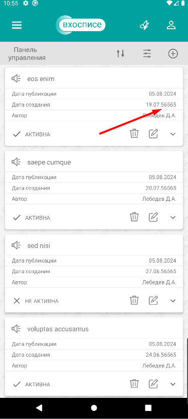
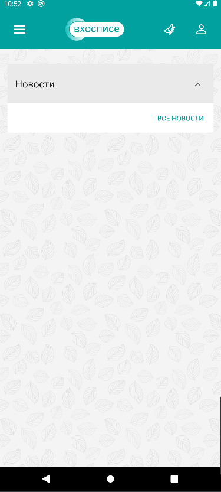
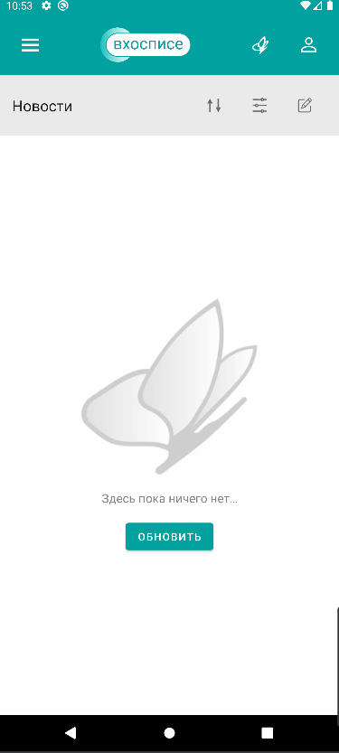
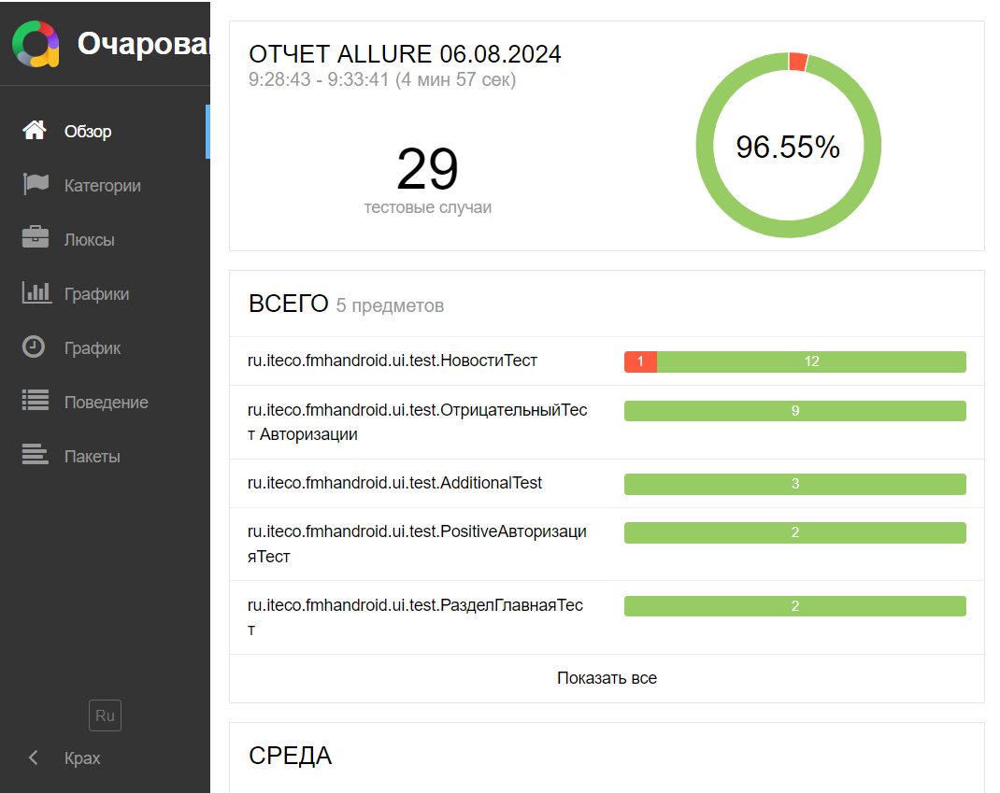

# Отчет о проведенном тестировании приложения "Мобильный хоспис" версия 1.0.0

## Краткое описание приложения и цели тестирования

Мобильное приложение "Мобильный хоспис" версия 1.0.0. Приложение предоставляет функционал для работы
с новостями хосписа,чтение теметических цитат и включает в себя:

- Информацию о новостях и функционал для работы с ними.
- Тематические цитаты.
- Информацию о приложении.

### Цели тестирования

- Проверить функциональность приложения и выявить дефекты
- Оценить качество и стабильность приложения
- Проверить совместимость приложения с различными устройствами и платформами
- Оценить производительность и скорость приложения
- Проверить безопасность и защищенность приложения
- Выявить и исправить проблемы с пользовательским интерфейсом и пользовательским опытом

## Результаты тестирования

### В ходе тестирования проверены:

- страница "Авторизация".
- страница "Главная".
- страница "Новости".
- страница "Панель управления новостями".
- страница "Тематические цитаты".
- страница "Фильтр" панели управления.
- страница "Фильтр" страницан новости.
- страница "Оприложении".

### Количество тест-кейсов:

- Ручное тестирование: 61, из них пройдены успешно - 49 (80,33 %)
- Автоматизированное тестирование: 29, покрыто кодом - 29 (100 %)

### Покрытие кода автоматизированными тестами

Успешных -25 (86.2 %)
Неуспешных  - 4 (13.8 %)

**Причины неуспешных тестов:**

- Некорректное поведение при создании новости
- Нестабильная работа приложения

### Дефекты выявленные при автоматизации

**Краткое описание выявленных дефектов**

- **1.Некорректное поведение при создании новости:**

  **[Тест-Кейс DN003](https://github.com/gluk2309/Diploma/issues/2)**
  Созданная новость отображается с неверной датой создания
  -
  
  -
- **2.Нестабильная работа приложения:**

  **[Тест-Кейсы G002, L006, N014](https://github.com/gluk2309/Diploma/issues/12)**
  После нескольких итераций тестирования (2-5 раз) созданный контент перестаёт отображаться,
  что делает невозможным проверку результата.

  **Главная страница - контент не отображается**
  -

  

  **Страница новости - контент не отображается**
  -------------------------------

  

| [Allure_first_iteration](Allure_first_iteration.rar) - **Allure_Report после первой итерации** |
| -------------------------------------------------------------------------------------------------------------------- |
|                                                             |

    -

| [Allure_Report_Crash](Allure_Report_Crash.rar) - **Allure_Report после нескольких итераций** |
| ---------------------------------------------------------------------------------------------------------------------- |
|                                                     |

### Дефекты выявленные при ручном тестировании

**Краткое описание выявленных дефектов**

**[Тест-кейс G003](https://github.com/gluk2309/Diploma/issues/1)**
1. Гланая страница не обновляется.

**[Тест-кейс DN003](https://github.com/gluk2309/Diploma/issues/2)**
2. Созданная новость отображается с неверной датой создания.

**[Тест-кейс N016](https://github.com/gluk2309/Diploma/issues/3)**
3. При восстановлении интернет-соединения после обрыва, страница новостей не обновляется.

**[Тест-кейс N018](https://github.com/gluk2309/Diploma/issues/4)**
4. Невозможно создать новости в новой категории.

**[Тест-кейс L002](https://github.com/gluk2309/Diploma/issues/5)**
5. Ссылка "Политика конфиденциальности" не загружается.

**[Тест-кейс L0021](https://github.com/gluk2309/Diploma/issues/6)**
6. Ссылка "Пользовательское соглашение" не загружается.

**[Тест-кейс L003](https://github.com/gluk2309/Diploma/issues/7)**
7.  Переход со страницы новости на страницу о приложении невозможен.

**[Тест-кейс L008](https://github.com/gluk2309/Diploma/issues/8)**
8. Элементы интерфейса отображаются некорректно при использовании тёмной темы.

**[Тест-кейс L009](https://github.com/gluk2309/Diploma/issues/9)**
9.  Фильтр на странице "Новости" работает некорректно в планшетном режиме.

**[Тест-кейс L009](https://github.com/gluk2309/Diploma/issues/10)**
10.  Фильтр на странице "Панель управления новостями" работает некорректно в планшетном режиме.

**[Тест-кейс L023](https://github.com/gluk2309/Diploma/issues/11)**
11. При обрыве интернет-соединения при старте приложения и последующем его востановлении, приложение не загружается.

**[Все дефекты задокументированы](https://github.com/gluk2309/Diploma/issues)**

### Общий итог по времени

Запланировано - 180 часов рабочего времени
Потрачено всего - 176 рабочего времени

### Время требующееся на прохождение тестов

Ручное тестирование - 1 час

Автоматизированное тестирование - 5 минут

## Заключение

### Приимущества подходов тестирования
   Ручное тестирование требует меньше времени на старте, но становится более трудоёмким при дальнейшем использовании. Автоматизированное тестирование, наоборот, требует больше времени на начальном этапе, но позволяет экономить время и ресурсы в долгосрочной перспективе. Кроме того, автоматизированное тестирование позволяет выявить нестабильные части кода и повторять тесты множество раз, что повышает надёжность и качество приложения.

Учитывая эти преимущества, можно сделать вывод, что автоматизированное тестирование является важным инструментом для обеспечения качества приложения.

### Рекомендации

   В ходе тестирования приложения выявлены дефекты, влияющие на корректность работы приложения. Для обеспечения высокого качества приложения и удовлетворения потребностей пользователей необходимо устранить выявленные дефекты и провести повторное тестирование приложения.
